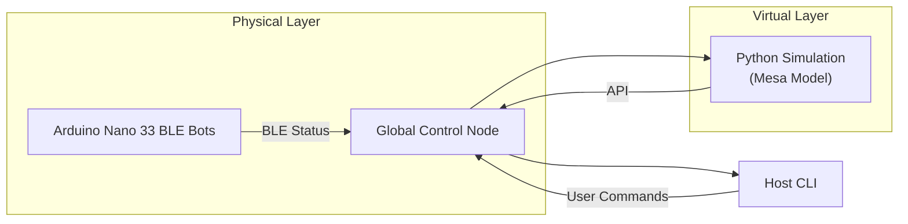

# Liquid Symbiote Swarm Robotics Prototype

[](./LICENSE)  
[](https://www.python.org/downloads/)  
[](https://store.arduino.cc/products/arduino-nano-33-ble)

> A hybrid physical-virtual swarm robotics sandbox, inspired by “liquid symbiote” concepts.  
> Combines Arduino-based micro-robots with a Mesa-powered Python simulation and a CLI for orchestration.

---

## 🚀 Table of Contents

1. [🎯 Features](#-features)  
2. [⚙️ Architecture Overview](#️-architecture-overview)  
3. [📦 Repository Layout](#-repository-layout)  
4. [🛠️ Prerequisites](#️-prerequisites)  
5. [🚧 Installation & Setup](#-installation--setup)  
   - [1. Arduino Firmware](#1-arduino-firmware)  
   - [2. Python Simulation](#2-python-simulation)  
   - [3. Global Control](#3-global-control)  
   - [4. Host CLI](#4-host-cli)  
6. [📋 Usage Examples](#-usage-examples)  
7. [📖 Documentation](#-documentation)  
8. [🤝 Contributing](#-contributing)  
9. [⚖️ License](#️-license)  

---

## 🎯 Features

- **Physical Prototype**: Arduino Nano 33 BLE bots (~5 cm diameter) simulating energy, BLE comms, and magnetic “formation mode.”  
- **Agent-Based Simulation**: Built with [Mesa](https://mesa.readthedocs.io/) for rapid prototyping of swarm behaviors.  
- **Global Orchestrator**: Python scripts to step the simulation, broadcast formation commands, and collect stats.  
- **Host CLI**: Simple command-line interface to monitor vitals (simulated) and issue high-level orders.  
- **Modular & Extensible**: Swap in real sensors, add new formation algorithms, or extend the BCI interface.

---

## ⚙️ Architecture Overview


- **Bots** broadcast battery & formation status over BLE.  
- **Simulation** runs in parallel, mirroring physical layout for testing.  
- **Orchestrator** (`global_control/orchestrator.py`) steps both worlds and syncs commands.  
- **CLI** (`host_interface/cli.py`) lets you check vitals or trigger “FORM” across bots/agents.

  ## 📦 Repository Layout

```
  liquid-symbiote-prototype/
├── LICENSE
├── README.md
├── .gitignore
├── firmware/
│   └── ArduinoBots/
│       ├── Bot.ino
│       └── config.h
├── simulation/
│   ├── requirements.txt
│   ├── agent.py
│   └── model.py
├── global_control/
│   ├── orchestrator.py
│   └── swarm_comm.py
├── host_interface/
│   ├── cli.py
│   └── biometrics.py
└── docs/
    └── architecture.md
```
## 🛠️ Prerequisites

- **Hardware (optional):**
  - Arduino Nano 33 BLE (one per bot)
  - Inductive charging pad or simulated power pad

- **Software:**
  - Arduino IDE ≥1.8.19
  - Python 3.9+
  - Pip packages: see `simulation/requirements.txt`
    
## 🚧 Installation & Setup

1. **Arduino Firmware**
   1. Open `firmware/ArduinoBots/Bot.ino` in Arduino IDE.  
   2. Edit `config.h` to assign a unique `BOT_ID` for each board.  
   3. Upload to Nano 33 BLE.  
   4. Place bots on an inductive pad or simulate with `A0` tied HIGH.  

## 2. Python Simulation
~~~
cd simulation
pip install -r requirements.txt
~~~

- **Files:**
  - `agent.py` — defines `SymBotAgent`
  - `model.py` — defines `SymBotModel` (100–200 agents by default)

## 3. Global Control

~~~
cd global_control
python orchestrator.py
~~~
- Steps the Mesa model and then triggers a “formation” flag.  
- Uses `swarm_comm.broadcast_command()` to set `agent.formed = True`.  

## 4. Host CLI

~~~
cd host_interface
python cli.py status     # Show simulated biometrics
python cli.py form       # Issue formation command to both bots & agents
python cli.py simulate   # Run full orchestrator + simulation loop
~~~

## 📋 Usage Examples

~~~
# Check vitals
python host_interface/cli.py status

# Spread swarm randomly, then form into shape
python host_interface/cli.py simulate

# Directly engage formation
python host_interface/cli.py form
~~~

## 📖 Documentation

- **Architecture:** `docs/architecture.md`  
- **Firmware API:** Inline comments in `Bot.ino` & `config.h`  
- **Simulation:** Mesa docs + comments in `agent.py` & `model.py`  

## 🤝 Contributing

1. Fork the repo  
2. Create a feature branch: `git checkout -b feat/my-feature`  
3. Commit your changes: `git commit -m "Add my feature"`  
4. Push to your branch: `git push origin feat/my-feature`  
5. Open a Pull Request  

Please follow the existing code style and include tests for any new functionality where possible.  

## ⚖️ License

- This project is licensed under the MIT License.  
- See `LICENSE` for full text.  


```text
MIT License

Copyright (c) 2025 xatusbetazx17

Permission is hereby granted, free of charge, to any person obtaining a copy
of this software and associated documentation files (the “Software”), to deal
in the Software without restriction, including without limitation the rights
to use, copy, modify, merge, publish, distribute, sublicense, and/or sell
copies of the Software, and to permit persons to whom the Software is
furnished to do so, subject to the following conditions:

The above copyright notice and this permission notice shall be included in all
copies or substantial portions of the Software.

THE SOFTWARE IS PROVIDED “AS IS”, WITHOUT WARRANTY OF ANY KIND, EXPRESS OR
IMPLIED, INCLUDING BUT NOT LIMITED TO THE WARRANTIES OF MERCHANTABILITY,
FITNESS FOR A PARTICULAR PURPOSE AND NONINFRINGEMENT. IN NO EVENT SHALL THE
AUTHORS OR COPYRIGHT HOLDERS BE LIABLE FOR ANY CLAIM, DAMAGES OR OTHER
LIABILITY, WHETHER IN AN ACTION OF CONTRACT, TORT OR OTHERWISE, ARISING FROM,
OUT OF OR IN CONNECTION WITH THE SOFTWARE OR THE USE OR OTHER DEALINGS IN THE
SOFTWARE.

