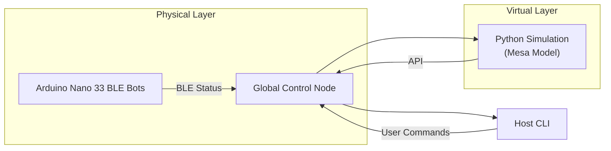

# Liquid Symbiote Swarm Robotics Prototype

  
  

> A hybrid physical-virtual swarm robotics sandbox, inspired by “liquid symbiote” concepts.  
> Combines Arduino-based micro-robots with a Mesa-powered Python simulation and a CLI for orchestration.

---

## 🚀 Table of Contents

1. [🎯 Features](#-features)  
2. [⚙️ Architecture Overview](#️-architecture-overview)  
3. [📦 Repository Layout](#-repository-layout)  
4. [🛠️ Prerequisites](#️-prerequisites)  
5. [🚧 Installation & Setup](#-installation--setup)  
   - [1. Arduino Firmware](#1-arduino-firmware)  
   - [2. Python Simulation](#2-python-simulation)  
   - [3. Global Control](#3-global-control)  
   - [4. Host CLI](#4-host-cli)  
6. [📋 Usage Examples](#-usage-examples)  
7. [📖 Documentation](#-documentation)  
8. [🤝 Contributing](#-contributing)  
9. [⚖️ License](#️-license)  

---

## 🎯 Features

- **Physical Prototype**: Arduino Nano 33 BLE bots (~5 cm diameter) simulating energy, BLE comms, and magnetic “formation mode.”  
- **Agent-Based Simulation**: Built with [Mesa](https://mesa.readthedocs.io/) for rapid prototyping of swarm behaviors.  
- **Global Orchestrator**: Python scripts to step the simulation, broadcast formation commands, and collect stats.  
- **Host CLI**: Simple command-line interface to monitor vitals (simulated) and issue high-level orders.  
- **Modular & Extensible**: Swap in real sensors, add new formation algorithms, or extend the BCI interface.

---

## ⚙️ Architecture Overview

## Bots broadcast battery & formation status over BLE.

## --Simulation runs in parallel, mirroring physical layout for testing.

## --Orchestrator (global_control/orchestrator.py) steps both worlds and syncs commands.

## --CLI (host_interface/cli.py) lets you check vitals or trigger “FORM” across bots/agents.

